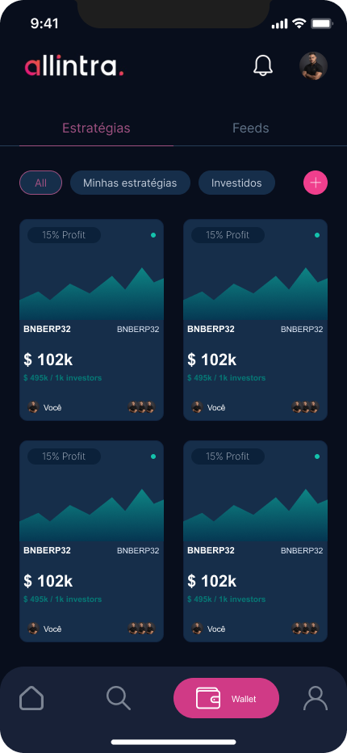

# Projeto Aplicativo de Criptomoedas

Este projeto é um aplicativo de criptomoedas que oferece funcionalidades de visualização de gráficos, cotações de moedas, notícias sobre o mercado financeiro e gestão de wallet. Inspirado na abordagem da empresa Allintra, mas com cores e experiência de usuário modificadas para fins demonstrativos.

 

## Configuração do Projeto

### Pré-requisitos

- Node.js versão 18.18.0

### Instalação

Clone o repositório e execute o comando abaixo para instalar as dependências e configurar o ambiente:

- **Com npm:**

  ```bash
  npm install

  ```

- **Usando yarn:**
  ```bash
  yarn install
  ```

- Este comando vai instalar as dependências necessárias para executar o projeto.

## Execução

### Para executar o aplicativo:

  ```bash
     npx expo start -c

  ```

## Características do Aplicativo

### Dashboard

A Dashboard apresenta informações de criptomoedas limitadas a 20 moedas para evitar sobrecargas, com gráficos de Linha, Área e Candles, que são interativos ao clique.

### Notícias

Integração com uma API de notícias genérica, mostrando títulos e introduções. A implementação foca na comunicação com a API e é apenas para fins demonstrativos.

### Wallet

Utiliza a API da Binance para listar criptomoedas com seus respectivos nomes e preços. Mostra como filtrar e exibir dados de APIs externas.

### Sobre Nós e Perfil

Estas páginas não foram desenvolvidas, mas as transições estão preparadas para futura implementação.

### WebSocket

Implementação simples e prática para integração na Dashboard, começando a mostrar os dados a partir do primeiro preço disponível.

### Gerenciamento de Estado

Utilização do Mobx para gestão de estado, mostrando ser uma biblioteca versátil para a manipulação de dados em tempo real.

## Tecnologias Utilizadas

- React Native
- MobX
- TypeScript (usado parcialmente para demonstração)
- APIs da Binance
- Design
- Escolhido um tema com cores escuras para facilitar a visualização prolongada e minimizar o desconforto visual.

## Autor

Luis Henrique Ramalho - (84)99919-3340 Whatsapp

## Considerações Finais

Com vasta experiência no mercado financeiro e desenvolvimento de robôs para trading automatizado, este projeto representa uma oportunidade de unir conhecimentos técnicos a uma paixão pelo mercado de criptomoedas.
